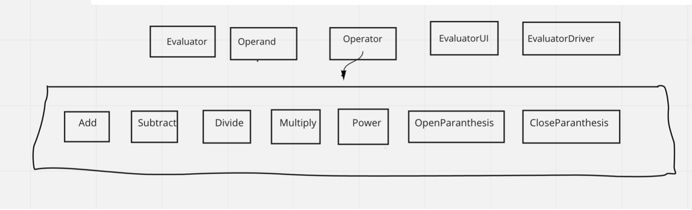
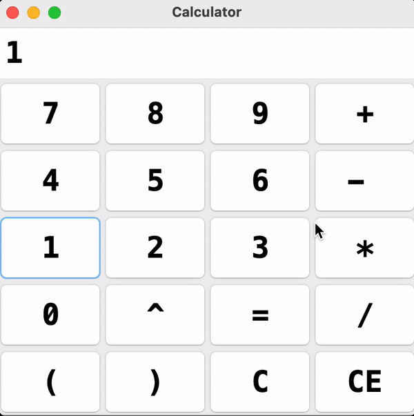

# Expression-Evaluator or Calculator

## DESCRIPTION

This project served as an introduction to Object Oriented Design and its concepts to provide structure and scalability to the code. The goal was to implement an expression evaluator class with specific and correct operators and operands and the rules. The expressions would be read by String Tokenizer class in Java and are stored as “tokens”. Each token will be pushed into two different stacks i.e. Operator and Operand class for each token. They will then be operated upon based on simple priority rules for +, -, /, *, ^, (,). It will take single tokens or variables and then compute them based on its priority in the whole equation and also based on simple mathematics rules. Then outputs the calculated answer. Invalid equations or expressions won’t work because they are invalid so one has to erase them and write one that can be computed. The code is connected to an interface which displays a mini calculator for you to perform actions.

## DEVELOPMENT ENVIRONMENT

Version of JAVA Used: Java JDK 1.8.0_191
IDE Used: IntelliJ IDEA 2020.2.3

## STEPS TO BUILD AND IMPORT

Use the root folder to import the files directly into IntelliJ.  
In IntelliJ, go to "Project Structure -> Modules", and change the following settings. 
Set the Github repo as the Content Root. 
Set the Expression-Evaluator-Calculator/ calculator folder as a Source. 
Build the EvaluatorDriver.java. 

## STEPS TO RUN THE CALCULATOR

Run the EvaluatorUI.java for GUI of Calculator and a mini Calculator GUI will pop up.  

## PROJECT CONCLUSION

With this project I was able to brush up on my JAVA skills and Data Structures knowledge to implement the expression evaluator with certain methods and classes and how the whole navigation works. I was successfully able to pass all the test cases provided , and also I test my work with some expressions that I created, and it successfully passed those as well. The most challenging part for me was to figure out how to solve the embedded parenthesis as initially my algorithm only evaluated SimpleParanthesis, I used the debugger to optimize my algorithm to pass some tests and to find errors throughout the program. Also connecting GUI was a bit tricky but eventually worked out well.

## CLASS DIAGRAM

## GUI of CALCULATOR

